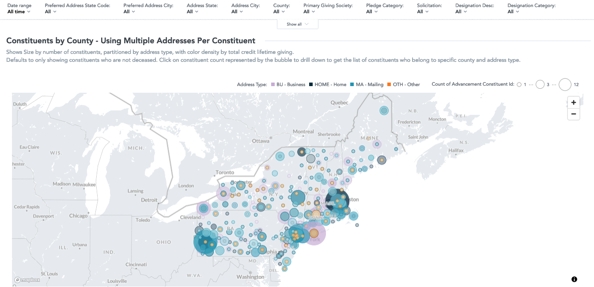

# Jacob Hickson Portfolio

Much of my work to date has been on private repositories.

This public repository is intended to provide a high-level overview of the kinds of projects I have worked on and the kinds I hope to work on in the future.
The `develop` branch contains all the works-in-progress and this `main` branch is what I feel most confident in sharing.

You can see my published docs at https://jacobhickson.github.io/portfolio/

With time I will try to abstract some of the proprietary work I have done into public repositories.

# Summary of Proprietary Work Not Shown Here

## 1. Higher Education Canonical Data Model

Using an abstract entity metadata definition, this data model was archived as json in a git repository.
The repo paired with a command-line utility to run the data model through a series of tests to ensure the model was valid, including json validation.

The content for this model was vetted against functional requirements and validated against a series of data sources. 
It was then robustly tested by institutions to ensure it met their needs.

An artifact of early development were well-documented data model design principles for a business-oriented object enterprise warehouse model.

## 2. ELT/ETL for Data Warehouse Product

The CI/CD in gitlab includes postgres service containers to run unit tests against the SQL syntax.
This was a series of postgres SQL DML statements to populate the canonical model.

## 3. Analytics-as-Code: Dimensional Logical Data Models

Against the canonical model, a series of dimensional models were created to support analytics.
These models were also archived as json in a git repository.

The command-line utility also has a GoodData client to handle metadata synchronization and facilitate deployment.
Lamentably my firm was on a legacy platform edition of GoodData that did not include robust native support for CI/CD integration using jinja templates. 

We were able to replicate a lot of this behavior, but ideally it would leverage the native cloud-version functionality. 

However, I found this valuable as it introduced me to some of the notions of analytics-as-code that you see in tools like Looker and other tools like DBML for dbdiagram.io 
and dbt. 

## 4. Test Data Generation Engine

Using pandas, built out an in-house data-generation engine that has some of the same concepts as `mimesis` but was optimized for our use case.

In higher ed it is particularly critical to protect student data and FERPA has some vague definitions that make it much better to avoid any masking in favor of fabrication. 

We incorporated some statistical distributions so we could shape demo and test data to support specific narratives in our live demo site.

*Example Screenshots of Fabricated Data in GoodData*

## 5. Connector Code

I had extended our abstract Database + REST API connector code to support a variety of data sources, including postgres, Jira, Salesforce, and others.

